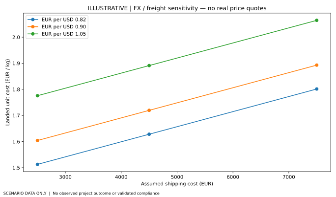

**Illustrative model, not compliance assurance or a current price survey.** Original source: market-entry outline prepared for the Sri Lankan fertiliser proposition.

## Regulatory decision boundary

The code requires classification and documentary evidence for possible EU-harmonised and German national marketing routes. No claims of automatically mandatory CE marking across all product routes. Product function and component-material categories, formulation, lab testing, safety, labelling and importer duties must be reviewed by qualified professionals. A complete checklist **is not legal conformity**.

## Screening arithmetic

For hypothetical shipment quantity $Q$ kg, unit landed cost is `(product + freight + toy import duty + port + testing + Q × storage)/Q`, in EUR/kg. A break-even quantity can be calculated only when the per-kg contribution is positive. Exchange-rate and freight factors in the CSV are *illustrative parameters*, not market observations.

## Reproducibility

Run `python -m pytest` and `python scripts/run_all.py`. Inspect `outputs/REGULATORY_GAPS.json` alongside the illustrative economics CSV and the source register. The result remains **UNDETERMINED** until an expert assesses an exact product and route, regardless of checklist completeness.

## Generated illustration

This figure is computed solely from the explicitly illustrative input CSVs. It is not a project fact or statistically estimated quantity.

## Static reproducibility snapshot

View the [worked illustrative input-to-output table](../docs/ILLUSTRATIVE_RESULTS_PREVIEW.md), regenerated by a deterministic analysis run. This is not an empirical estimate.
